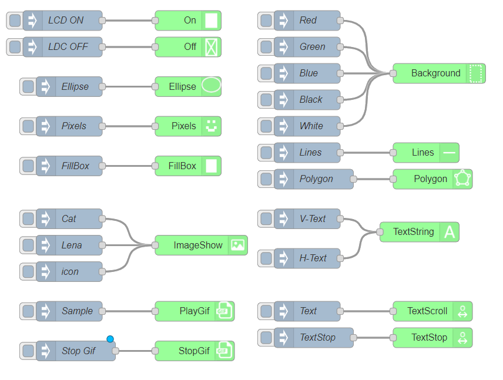
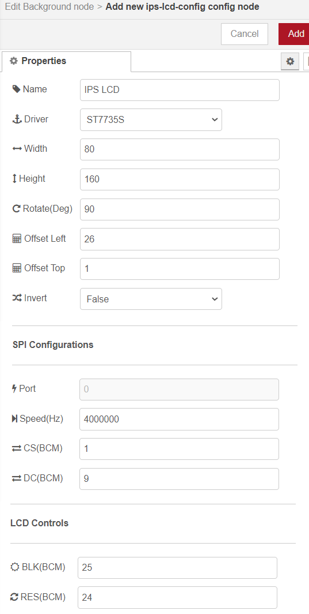

node-red-contrib-st7735s
=========================




Node-Red node to talk to ST7735S TFT displays, connected by Raspberry Pi's SPI. 
The node is using [JSPyBridge](https://github.com/extremeheat/JSPyBridge) to provide the JS bindings for the [Python ST7735](https://github.com/pimoroni/st7735-python)
using `Standard Error` as the IPC. Additionally, all the functionalities provided is using the [PIL]() `Image` and `ImageDraw` module. Requires `Node.JS` >= 16 and `Python` 
to be installed. 

# Usage

## Enable SPI
Enable the Raspberry Pi SPI interface via GUI or `raspi-config`

## Install the `Python ST7735` from `Pimoroni`:
**Python2**
```
sudo apt update
sudo apt install python-rpi.gpio python-spidev python-pip python-pil python-numpy

sudo pip install st7735
```

**Python3**
```
sudo apt update
sudo apt install python3-rpi.gpio python3-spidev python3-pip python3-pil python3-numpy

sudo python3 -m pip install st7735
```

Run the python `examples` to make sure its working. This node  fully rely on this installation to be working.

## Install node-red-contrib-st7735s

```
cd ~/.node-red
npm install node-red-contrib-st7735s
```
or install it via NodeRed pallete manager.

Config:



The default value should be working for 0.96' ST7735S IPS LCD display. However, take note on the `Width` and `Height`
values. The ST7735s has a Frame RAM of `ST7735_COLS = 132` and `ST7735_ROWS = 162`. The number of columns is less than 
the columns of the display (`160`). Thus the `width` is set to `80` and the `height` to `160` then rotated `90` degree.  
  
The default value of `Offset Left` and `Offset Top` is given by `Python ST7735` library however it produces some
undesirable artifacts on my testing unit. Setting it to:

**`Offset Left = 24`**  
**`Offset Top  = 0`**

seems to eliminate it.  


# Features

* Tested with Raspberry Pi 4B.
* In the `examples` directory there is a flow (`example.json`) that you can use for testing.
* Read the `node` docs for details operation.
* Be mindful of `PlayGif` and `TextScroll` node. These nodes needs to be stopped with `StopGif` and `TextStop`
before drawing another stuff on the LCD.  


If you are seeing this error when stopping the NodeRED:
```
Traceback (most recent call last):
  File "/home/pi/Pimoroni/node-red-contrib-st7735s/node_modules/pythonia/src/pythonia/interface.py", line 53, in <module>
    com_io()
  File "/home/pi/Pimoroni/node-red-contrib-st7735s/node_modules/pythonia/src/pythonia/interface.py", line 42, in com_io
    data = apiin.readline()
  File "/usr/lib/python3.9/socket.py", line 704, in readinto
    return self._sock.recv_into(b)
KeyboardInterrupt
```

It is ok. It just the `JSPyBridge` things.


# Please Contact Us
If you have any problem when using our package, please contact us..
